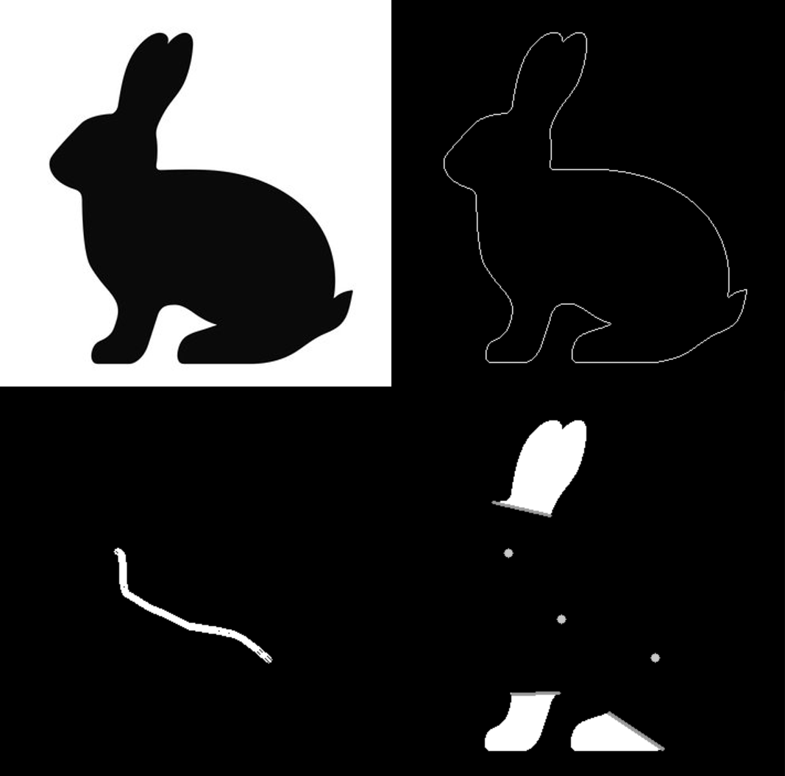

# ScriptSculpt
Before Cmake, please download opencv 4.80 and set the opencv lib directory as OpenCV_DIR environment variable in your computer.

## Beta Version Visualization
- **Initial Alignment** (Week of Mar 25th)

    * Anchor-Protrusion Correspondence
        * Each protrusion is possibly matched with an anchor based on the loacation and orientation compatibility score.
    * Initial Placement
        * First position letters that have a match with protrusion.
        * Then position other letters, keeping them as evenly spaced as possible.
        
- **Refined Alignment** (Week of Mar 25th)

    * Using GA, find the best alignment that minimize the combined layout energy.
    * No control point deformation so far.

- **Letter Deformation** (Week of April 1st)

## Alpha Version Visualization
- **Bezier Curve Representation of English letters** (Week of Mar 11th)
    * For consistency, only Bezier curve segments of degree 3 is used, including the representation of straight lines. This allows for letter deformation later.
    * Normalized all bounding area to be 160,000 (the actual width and height is consistent with the original aspect ration of each letter).
    * Libraries Used:
        * FontForge (used to generate svg file from font file)
        * svg.path (used to parse svg file in python)
        * opencv (used to visualize Bezier curve segments in C++)
        * matplotlib (used to visualize Bezier curve segments in python), not part of the actual project
- **Letter Anchors** (Week of Mar 18th)
    * Each letter anchor has a cutting line that is visualized through the black line.
    * Adjustments: Letter j and t looks different than the font provided in the paper, so their anchors are adjusted accordingly to be straight.

- **Shape Preprocessing** 

