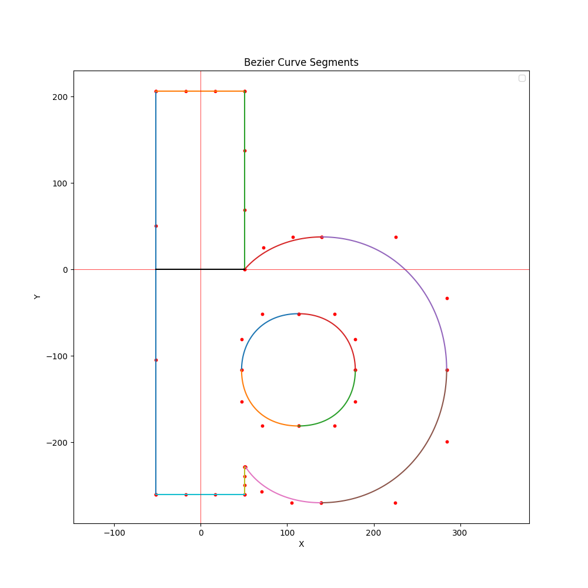
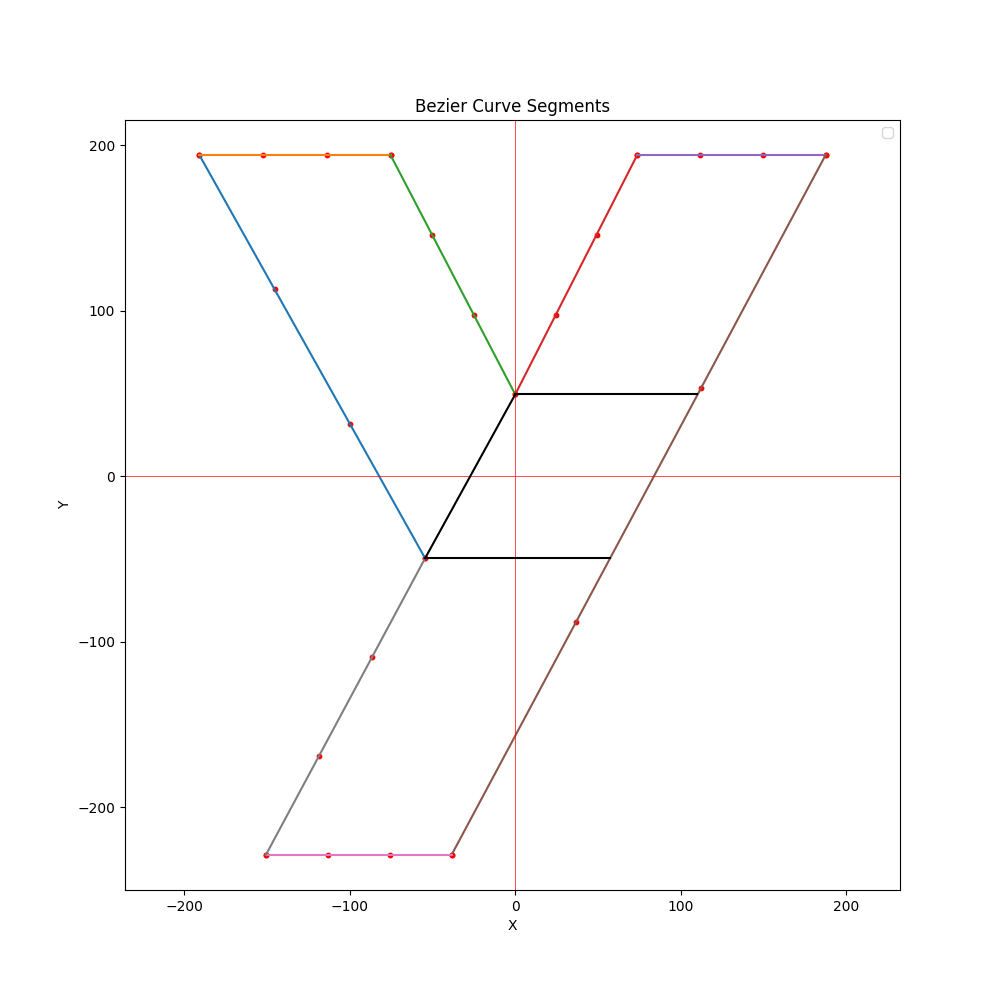

# ScriptSculpt
Before Cmake, please download opencv 4.80 and set the opencv lib directory as OpenCV_DIR environment variable in your computer.

## Alpha Version Visualization
- **Bezier Curve Representation of English letters** (Week of Mar 11th)
    * For consistency, only Bezier curve segments of degree 3 is used, including the representation of straight lines. This allows for letter deformation later.
    * Libraries Used: 
        * FontForge (used to generate svg file from font file)
        * svg.path (used to parse svg file), not part of the actual project
        * matplotlib (used to visualize Bezier curve segments), not part of the actual project

